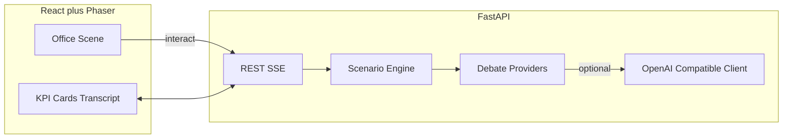

# Activist Pixel Office Simulation

## Locked decisions

- **Player:** activist fund lead at fictitious **Meridian Dynamics** HQ
- **Control:** full RPG (WASD, collide, `E`/click interact with NPCs and zones)
- **Look:** Pixel Agents–style office (open Kenney/LPC or compatible assets); engine is **Phaser 3**, not a Pixel Agents visualizer fork
- **Stack:** Vite + React + Phaser client; Python **FastAPI** backend; OpenAI-compatible **GitHub Copilot gateway** for optional LLM dialogue only (no Claude Code / CLI)
- **Scoring:** authored + deterministic; LLM never sets KPI deltas
- **Default debate:** scripted/deterministic; gateway and line-graph swarm are pluggable
- **POC = final sim shell:** playable local single-player; multiplayer only in final phase
- **Teammate work:** unknown repo state — keep `ScoringEngine` / `DebateProvider` contracts stable so their FastAPI/line-graph code can drop in
- **Docs:** implementation creates [`SPEC.md`](SPEC.md) (agent build instructions). No separate markdown plan file beyond this Cursor plan

## Architecture



**Repo layout (new monorepo; adapt if teammates already scaffolded):**

```
frontend/          # Vite React Phaser
backend/
  app/main.py
  app/api/         # sessions, decide, debate stream
  app/engine/      # pure scoring state machine
  app/providers/   # deterministic | gateway | swarm stub
  scenarios/       # meridian-activist-01.json
SPEC.md            # agent implementation bible
```

## Game loop

Phases: `EXPLORE` → `BEAT_INTRO` → `DEBATE` → `AWAIT_DECISION` → `APPLY` → `CURVEBALL?` → `EXPLORE` | `GAME_END`.

Client sends `POST /sessions`, `POST /sessions/{id}/interact`, `POST /sessions/{id}/decide`; subscribes to `GET /sessions/{id}/events` (SSE) for debate deltas, KPI patches, news ticker, phase changes.

## Scenario content (9 beats)

File: `backend/scenarios/meridian-activist-01.json`

1. Stake build (trading floor)  
2. Private letter (CEO)  
3. Public thesis (press bay)  
4. Board seats vs review (boardroom)  
5. Capital return vs breakup (CFO)  
6. Mid-game curveball (seeded)  
7. Settle vs proxy (boardroom)  
8. Swing holders / ISS pitch (war room)  
9. Endgame vote (boardroom)

**KPIs:** `stockPrice`, `boardResistance`, `ownershipPct`, `warChest`, `mediaHeat`. Options include `label`, `pros[]`, `cons[]`, `deltas`, optional `requires`/`unlocks` flags. UI shows pros/cons only — never raw deltas pre-decision.

**NPCs:** CEO, CFO, GC, Independent Chair, Your Analyst, Activist Partner.

## Pluggable contracts

```python
class ScoringEngine(Protocol):
    def create(self, scenario: Scenario) -> GameState: ...
    def available_options(self, state: GameState) -> list[Option]: ...
    def apply(self, state: GameState, option_id: str) -> GameState: ...
    def summary(self, state: GameState) -> Summary: ...

class DebateProvider(Protocol):
    async def stream(self, ctx: DebateContext) -> AsyncIterator[DebateDelta]: ...
```

Providers selected by env `DEBATE_PROVIDER=deterministic|gateway|swarm`. Gateway uses `OPENAI_BASE_URL` + `OPENAI_API_KEY` (Copilot gateway). Swarm stub documents the line-graph event shape teammates must implement; scoring stays in `ScoringEngine`.

## Phaser world (POC)

- One tilemap: lobby, war room, trading floor, CEO/CFO/GC offices, boardroom, press bay
- Player arcade physics; BFS/simple pathfinding for NPCs to desks/seats
- Zone pads + NPC interact radii fire `interact` with `{targetId, beatId?}`
- Speech bubbles from SSE deltas; React overlay for cards/HUD/scorecard
- Free walk only in `EXPLORE`; input soft-locked to UI during `DEBATE`/`AWAIT_DECISION`

## Implementation phases

### Phase 0 — Recon (before coding against teammate code)
If another repo appears: map existing FastAPI routes, scenario format, and agent graph; rewrite only adapters so contracts above still hold. If starting here: scaffold greenfield.

### Phase 1 — Scaffold
- `frontend` + `backend` runnable locally (`uvicorn`, `vite`)
- CORS, `.env.example`, health route
- Write [`SPEC.md`](SPEC.md) with schema, routes, Phaser events, acceptance criteria (full outline below)

### Phase 2 — Engine + scenario
- Pure Python engine + JSON scenario with all 9 beats filled
- Pytest: deltas, win/lose, flag gates, seeded curveball, headless full run
- No Phaser dependency

### Phase 3 — Pixel office (visual POC core)
- Tilemap + sprites + WASD + collisions + 6 NPCs + zone pads
- Interact prompt UI; camera follow
- Playable “empty” office before backend wiring

### Phase 4 — Wire loop
- Session API + SSE
- Beat activation on interact; debate stream → bubbles/transcript; option cards; KPI animation; scorecard
- Deterministic provider only — full 9-beat game completable offline with no API key

### Phase 5 — Gateway + swarm stub
- `GatewayDebate` streaming via OpenAI-compatible client; timeout → deterministic fallback
- `SwarmDebate` interface + fake stream documenting teammate line-graph hook
- Env switch documented in SPEC

### Phase 6 — Polish
- News ticker, lobby-once-per-beat bonus, seed in URL/query, qualitative-only cards, basic SFX optional
- Balance pass so mixed strategy wins ~40–60%

### Phase 7 — Multiplayer (last)
- Colyseus or FastAPI WebSocket rooms; rival activists or co-op spectator — only after local POC signed off

## SPEC.md outline (create in Phase 1)

1. Mission and hard constraints (local-first, gateway-only LLM, deterministic scoring)  
2. Monorepo layout and run commands  
3. Scenario JSON schema (exact fields)  
4. `ScoringEngine` / `DebateProvider` Python protocols  
5. REST + SSE API (request/response examples)  
6. Phaser ↔ React event bus names  
7. NPC/zone ID table matching scenario triggers  
8. Phase checklist with acceptance tests  
9. Integration notes for teammate swarm (“implement `SwarmDebate.stream` to this signature”)  
10. Definition of Done for POC

## Definition of Done (POC)

- Local `backend` + `frontend` → complete 9-beat activist game in &lt;20 minutes with WASD navigation and boardroom/office interactions  
- Works with `DEBATE_PROVIDER=deterministic` and no gateway key  
- Engine tests green; KPI math independent of LLM  
- `SPEC.md` sufficient for another agent to continue or swap in swarm scoring/orchestration  
- No multiplayer required

## Out of scope for POC

Claude Code hooks, Pixel Agents VS Code extension, deploying multiplayer, Capital-in-Peril / M&A scenarios (same engine later via new JSON only)